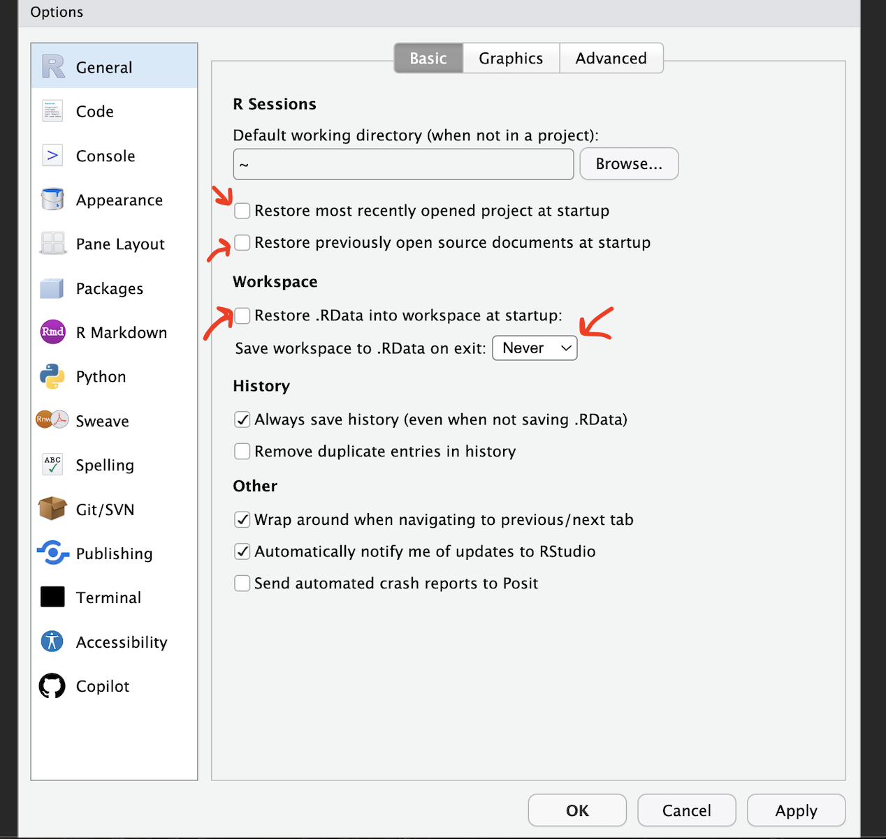

## Changing settings

R-studio wants to be helpful and will try to re-load exactly where you were in a project when you log back in.  This can get confusing, so we are going to turn this off.

  - Go to the menus at the VERY TOP OF THE SCREEN.
  - Click on Tools-> Global Options
  

Now, following the image below:

 - **UNCLICK** “Restore most recently opened project at startup”

 - **UNCLICK** “Restore .RData into workspace on startup”

 - Set “Save workspace to .RData on” exit to **Never**

 - **UNCLICK** “Restore previously open source documents on startup”

You can also click the appearances tab to change how the screen looks. This is why some people have fun colored screens.

