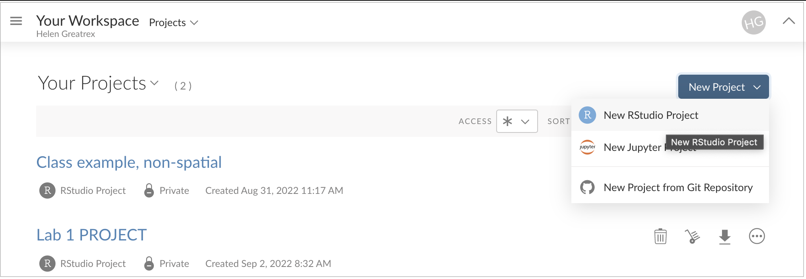
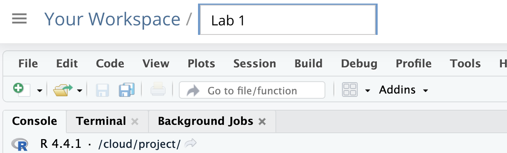

### Creating a new project

1.  **Visit the Posit Cloud Login Page:**

    -   Go to <https://login.posit.cloud/login> from any web browser. After logging in, you will see a dashboard similar
        to the image below.

2.  **Create a New Project:**

    -   Click the button on the top right and select “R-studio project.”

    -   A new R-studio Cloud instance will open. Rename it to match your lab.

### **Returning to your project**

-   To return to your labs, visit <https://posit.cloud/content/yours> or click the workspace menu in the top left.

