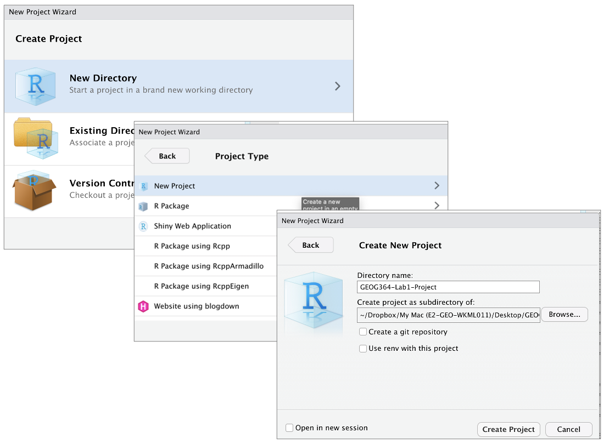

### Creating a new project


<br>

1.  If it's not already open, open **R-Studio** <br>
2.  Go to the File menu at the very top and click `New Project`. <br>
3.  Select `New Directory`, then `New Project`. <br>
4.  Name your project after your lab . <br>
5.  Under "create project as a subdirectory of", hit the browse button and go inside your GEOG-364 main folder (you just
    need to be in the folder, you don't need to have selected anything). Press open. <br>
6.  Finally, press `Create Project`, <br>

```{r, pg_Tut2_startup_fig4, echo=FALSE}

```

<br>

### How do I know it's worked?

R will change slightly.\
- If you look at the top of the screen in the title bar, it should say *Lab1-Project R Studio*.\
- The Files tab should have gone to your project folder. Essentially, R-Studio is now "looking" inside your Lab 1
folder, making it easier to find your data and output your results.


### Returning to your lab project


1.  On your computer, find your *GEOG-364* folder and go to the lab you want.\
2.  Double click on the file with the extension `.RProj`.
