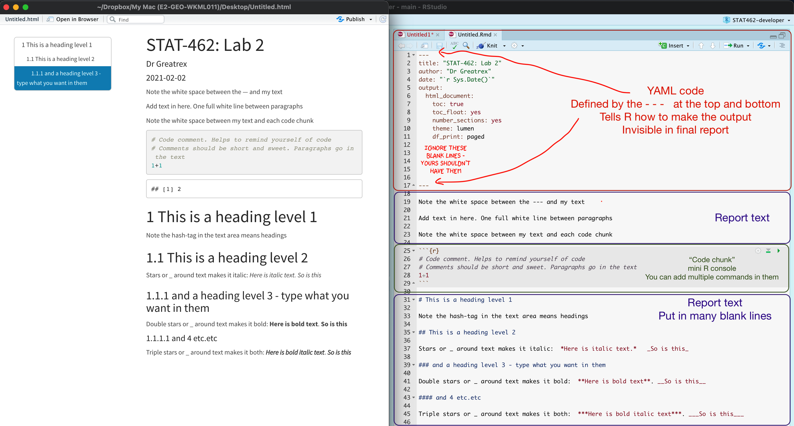

{width="100%"}

Your markdown file contains three main areas:

-   **The YAML code at the top describes what the final output should look like.**

    -   For example this might be a website, a pdf, a presentation or one of these 21 other
        formats...<https://rmarkdown.rstudio.com/lesson-9.html>

    -   It also includes other 'meta-data' for example the title/author name, whether you want a table of contents and
        any themes. For example, in the screenshot above, I included:

        -   The title
        -   The author (note,use your email ID not your name)
        -   Automatically created today's date
        -   A floating table of contents
        -   Numbered sections (this won't appear until you start typing section headings)
        -   The lumen theme.

    -   See "Editing YAML" below for more information.

-   **The report text.**

    -   This is essentially the same as Microsoft word, where you can write up interpretations, include pictures,
        tables, links and equations.. See "Editing text" below for more information.

-   **Code chunks**

    -   These are spaces for you to R-Code. They are essentially "mini consoles". To run the code inside, click the
        little green arrow on the right. This copies the code into the console, runs it, then copies the output
        underneath the code chunk, integrating it into your report. See "Editing R-Markdown" below for more information.
