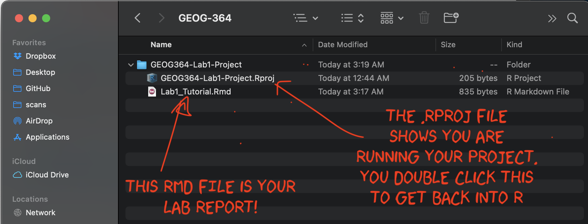
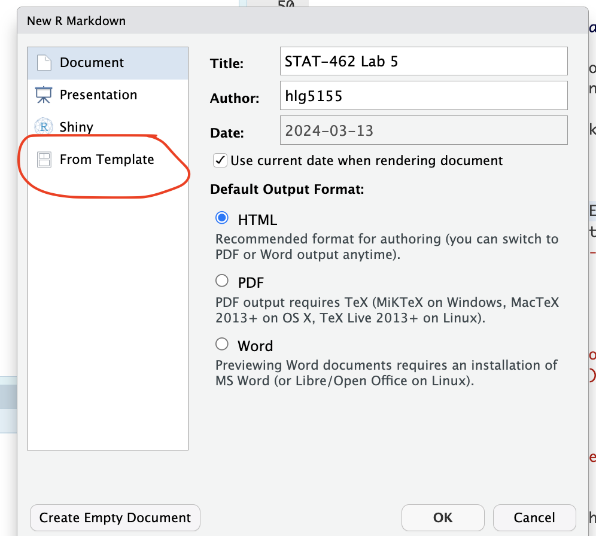
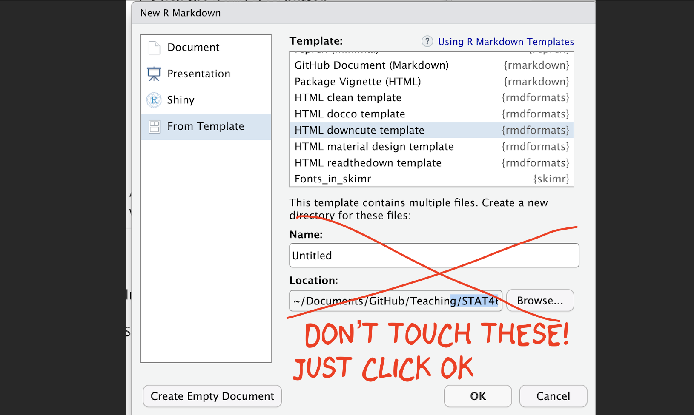

### Creating a basic R-Markdown document

 

To create a new R Markdown document

1.  **Go to** `File` → `New File` → `R Markdown...`
2.  **Choose a document type** (HTML, PDF, or Word). For now, \| select `HTML`.
3.  **Give your document a title** and specify the author as \| your Email ID e.g. hlg5155
4.  **Click `OK`**
5.  *If this is your first time ever doing this or you're running a new POSIT-Cloud project, then R-studio might ask to
    download some packages before it can do this this. Say yes.*
6.  A new file should appear on your screen. At the top of that window (by the knit button, there is a save button. Save
    it as something relevant INSIDE YOUR PROJECT FOLDER!

RStudio will generate a default R Markdown file with an example of formatted text and an embedded code chunk.

 

#### Further editing the YAML code

There are many different options you can add to a basic RmD file, by changing the YAML code at the top. For example you
can add a table of contents, make the auto-hide (code folding) or change the theme.

Click here to see examples of how to do this:
<https://psu-spatial.github.io/Stat462-2025/CH2_EACHLAB.html#34_Editing_YAML>

 

#### **Important**

-   Before you continue, on your computer (outside R-Studio), go to your project folder

-   MAKE SURE THE RMD FILE SAVED IN YOUR PROJECT FOLDER. Also, check you didn't accidentally create a load of
    sub-folders inside your lab. If so, delete/move things around until it looks like this.

 

------------------------------------------------------------------------------------------------------------------------

 

### Using a custom R template from a package

There are also now several package which contain professional markdown templates. Common examples include

-   The `rmdformats` package: See example themes here: <https://github.com/juba/rmdformats>
-   The `prettydoc` package: See example themes here: <https://prettydoc.statr.me/themes.html>

To use one of these packages:

+-----------------------------------------------------------+----------------------------------------------------------+
| 1.  Make sure the relevant package is installed (e.g.     |        |
|     packages tab, install button)                         |                                                          |
|                                                           |                                                          |
| 2.  **Go to** `File` → `New File` → `R Markdown...`       |                                                          |
|                                                           |                                                          |
| 3.  **Click the `Templates` button**                      |                                                          |
|                                                           |                                                          |
| 4.  **Select the template you want to use**.              |                                                          |
|                                                           |                                                          |
| 5.  **Click `OK`**.                                       |                                                          |
|                                                           |                                                          |
| 6.  A new file should appear on your screen. At the top   |                                                          |
|     of that window (by the knit button, there is a save   |                                                          |
|     button. Save it as something relevant INSIDE YOUR     |                                                          |
|     PROJECT FOLDER!                                       |                                                          |
|                                                           |                                                          |
| Alternatively, you can replace your YAML code with the    |                                                          |
| suggested code from that theme.                           |                                                          |
+-----------------------------------------------------------+----------------------------------------------------------+

 

#### Further editing the YAML code

There are many different options you can add to a basic RmD file, by changing the YAML code at the top. For example you
can add a table of contents, make the auto-hide (code folding) or change the theme.

The easiest way to see what is available for your particular theme is to go to the package website and take a look at
the documentation (scroll down). For example

-   The `rmdformats` package has various options for each theme <https://github.com/juba/rmdformats>
-   Similarly the `prettydoc` package has more description here <https://prettydoc.statr.me/themes.html>

You can also just try and edit the YAML code, press knit and see if it works. Click here to see examples of how to do
this: <https://psu-spatial.github.io/Stat462-2025/CH2_EACHLAB.html#34_Editing_YAML>

NOTE, PrettyDocs does NOT allow a floating table of contents.

 

#### **Important!**

Sometimes rmdformats makes an extra subfolder and puts your report in there.

-   So before you continue, on your computer (outside R-Studio), go to your project folder

-   MAKE SURE THE RMD FILE SAVED IN YOUR PROJECT FOLDER. Also, check you didn't accidentally create a load of
    sub-folders inside your lab. If so, delete/move things around until it looks like this.

 

------------------------------------------------------------------------------------------------------------------------

 

### Using ChatGPT for custom templates

Finally, we can now use ChatGPT to help make custom YAML code for whatever template you want or to help you fix broken
themes/YAML code. It will almost certainly take interations - and look at github or google cool markdown formats for
examples.

For example,

-   How to make a template that includes a logo/header, and a discussion about what styles.css is
    <https://chatgpt.com/share/67e44d44-8254-800f-a2bf-b447464a4f4a>

-   A silly template for a PI who likes penguins using a new google font
    <https://chatgpt.com/share/67e44f17-a760-800f-850e-479c63776883>

 

------------------------------------------------------------------------------------------------------------------------

