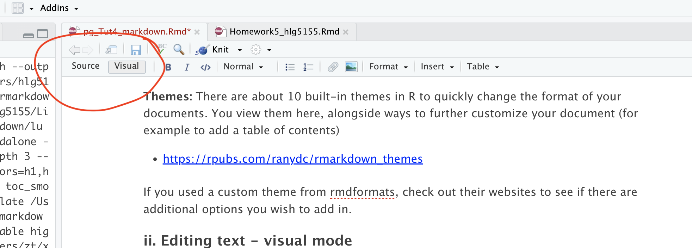

### Visual vs source mode

RStudio's standard output is "**source mode**" where you see your text in a raw format.

RStudio now provides a **Visual Editor** to simplify text formatting. When switched on, you see something similar to the
final output format and get access to all the normal word processing buttons (e.g. bold/headings etc.). To switch
between the two modes:

1.  Click the **Visual** tab in the `.Rmd` editor.

2.  Use the toolbar to format text, add links, or insert images.

3.  Switch back to **Source** mode to view the underlying Markdown format.



Visual mode is incredibly useful, because you don't need to remember any of the keyboard commands for formatting text.
But... it can be a pain when editing/deleting code-chunks. To do that, I often switch back to source mode.


### Pictures and tables

These are easy to add using **visual mode**. Just go to the text-editing menu at the top of the report.

### Headings

Please use these! They allow your table of contents to be created correctly which allows easy navigation in your
reports. For example, Heading 1 = Chapter Title, Heading 2 = sub-title etc.

In visual mode, click on the line you want then look at the text formatting menu. Click the arrow by "normal" and change
to the heading you want.

### Mathematical equations

**THESE GO INTO THE TEXT SECTION! NOT INTO A CODE CHUNK.**

Although I have heard rumors you can copy/paste equations into R, the easiest way I have found is to:

1.  First, get the equation you want in chatgpt or similar and ask it to output as LateX format

2.  Type \$\$ to tell R you are adding an equation, then paste the equation in a line of its own.

e.g. If you type this into the TEXT (not a code chunk)

``` {asis="TRUE"}

$$
E_n = -\frac{m e^4}{2 \hbar^2} \frac{1}{n^2}
$$
```

In visual mode, you should see get

$$
E_n = -\frac{m e^4}{2 \hbar^2} \frac{1}{n^2}
$$

If you want an equation on the same line, use single \$ signs. E.g typing this into the TEXT

``` {asis="TRUE"}

Hello! Here is an inline equation: $e^4$, that you can include mid-sentence
```

Will give you

Hello! Here is an inline equation: $e^4$, that you can include mid-sentence.
