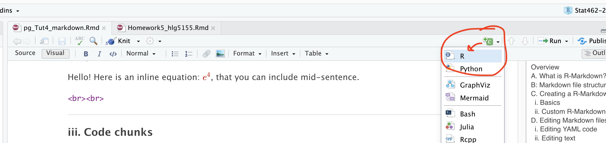
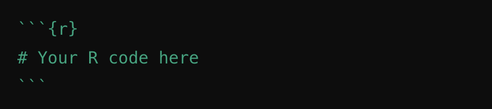

### Adding new code chunks

In visual mode, you can add code chunks by clicking on the little green button at the top right and choosing R.

{width="90%"}

In source mode, you can add a code chunk by typing

{width="49%"}

Where the little symbols before the {R} are called BACK-TICKS. I often just copy/replace.

### Running code chunks

There are several ways you can run the code in a code chunk. The easiest is to use the controls on each chunk.

-   **To run that chunk** → Click the **green "Play" (▶) button** in the top-right corner of the chunk.

-   **To Run all chunks above** → Click the small **downwards arrow** next to the left of the Play button.

Or via the Run menu on the top right.