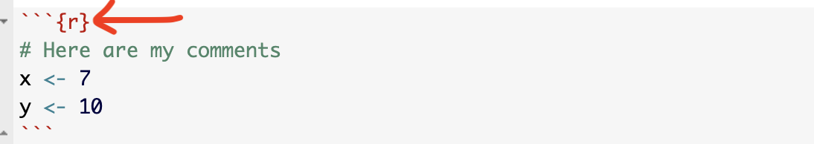
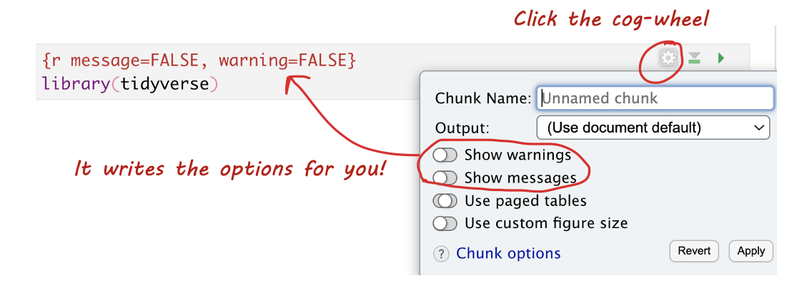

### Code Chunk Options 

#### What are they? 

Code chunk options control how your code behaves when you knit the document. You can suppress messages, hide warnings, or customize the appearance of your output. Here are some common options you might use:

- `message = TRUE/FALSE` — Show or hide R messages when knitting.
- `warning = TRUE/FALSE` — Show or hide warnings. Errors will still be displayed.
- `include = TRUE/FALSE` — Show or hide both the code and its output.
- `echo = TRUE/FALSE` — Show or hide the code but still display its output.
- `eval = TRUE/FALSE` — Show the code, but don't actually run it. Useful if you can't make it work, but want to still knit and submit.


#### Editing Options in Source Mode 

- Each code chunk starts and ends with three backticks. The `{r` inside the curly braces indicates it's R code.
- After `{r`, you can add options to modify the behavior of the code when knitting. For example, use `message=FALSE` and `warning=FALSE` to suppress library loading messages and warnings.

<div style="text-align: center;">
  {width="80%"}
</div>

<br>

#### Editing Options in View Mode 

In View mode, click the small cogwheel next to the run triangle at the top of the code chunk to set these options without remembering commands.

<br>

<div style="text-align: center;">
  {width="80%"}
</div>


#### Setting Default Options for the Whole Document


To apply settings to all code chunks, place this code chunk at the top of your document (below the YAML):

````
```{}
knitr::opts_chunk$set(echo=TRUE, 
                      warning=FALSE, 
                      message=FALSE)
```
````

Many templates include default settings, but you can easily customize them to fit your needs.


