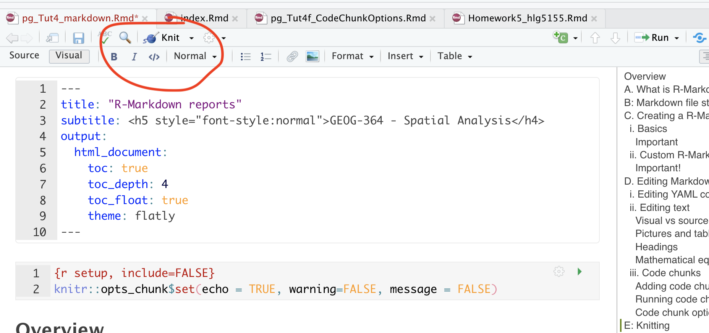
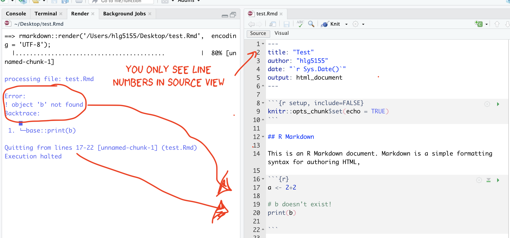

### Kniting your files

The file on your screen isn't the finished article. To see how it will look as a final version, we need to "knit" it.

Knitting an R Markdown document means **converting it into a final output format** (such as HTML, PDF, or Word). When you knit a document, RStudio executes the code chunks, formats the Markdown text, and generates a nicely formatted report.

Go to the top of the .Rmd file, find the `knit` button. Press it (you might have to first save your script if you haven't already, then press it again). This will only work if you have all the commands saved in your lab-script e.g. if you read in the data but didn't write the command into your report, it will crash.

#### IF YOU GET A KNITTING ERROR

The terminal text will update you as your report turns into a website. If you get an error, then the exact line number with the problem and a description of the error will be printed on the console. For example, here I tried to print out a
variable that didn't exist.

{width="100%"}