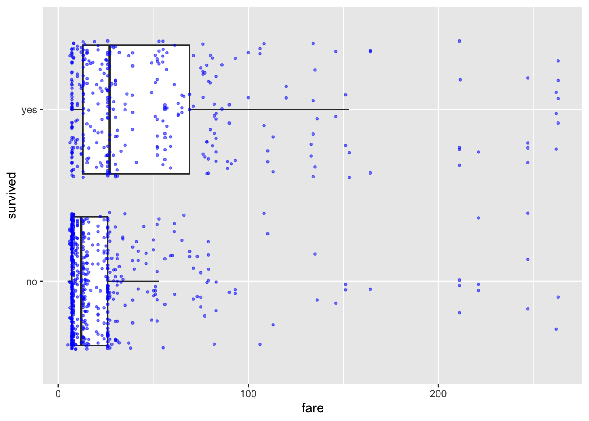
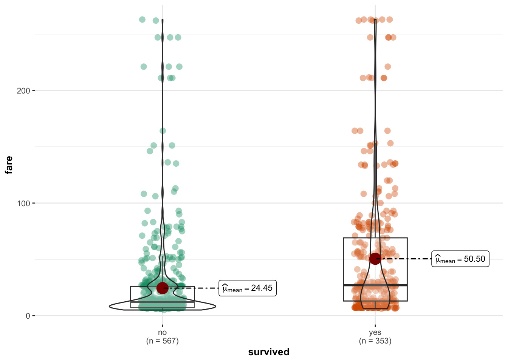
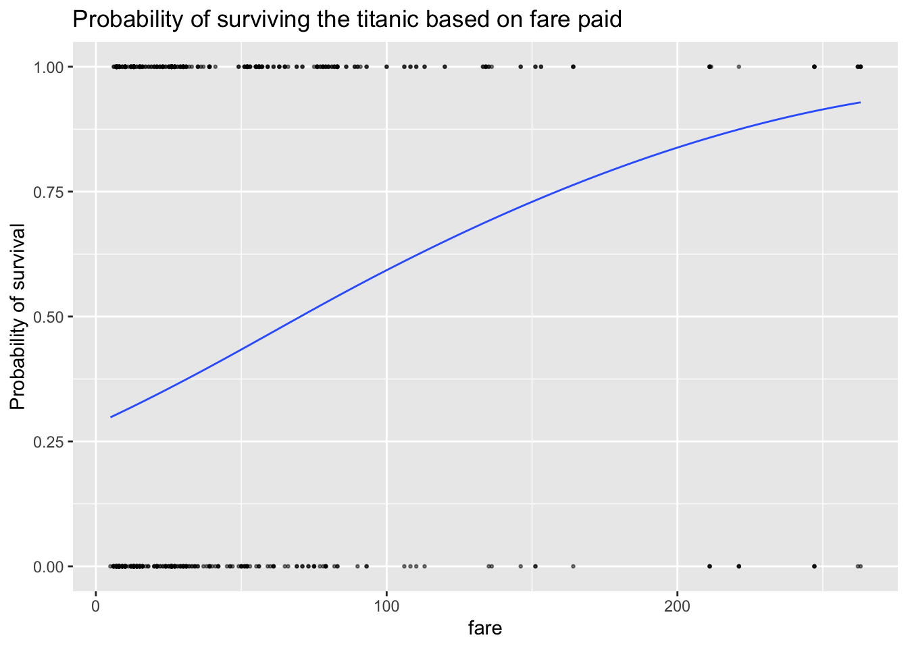
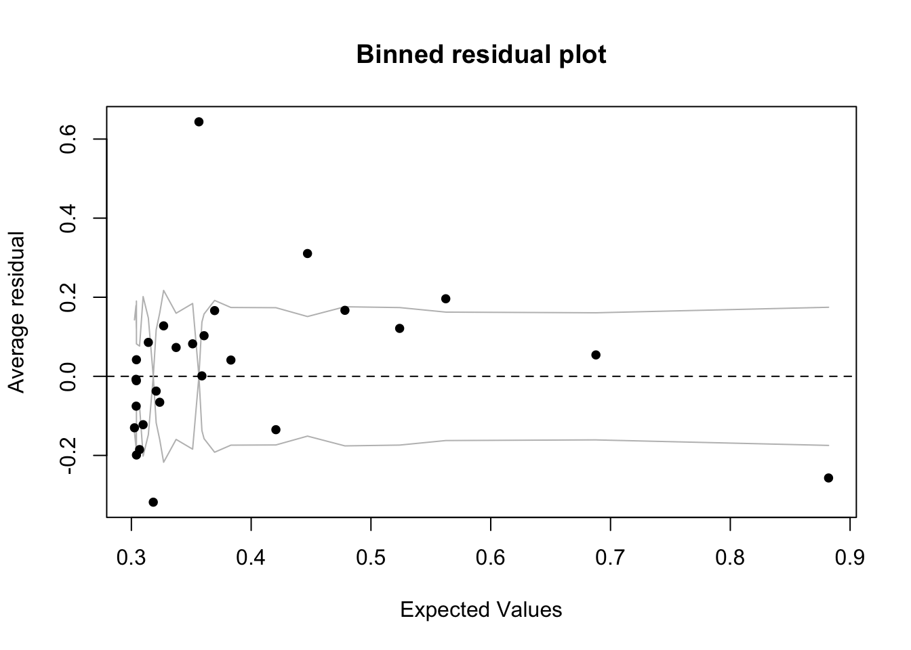
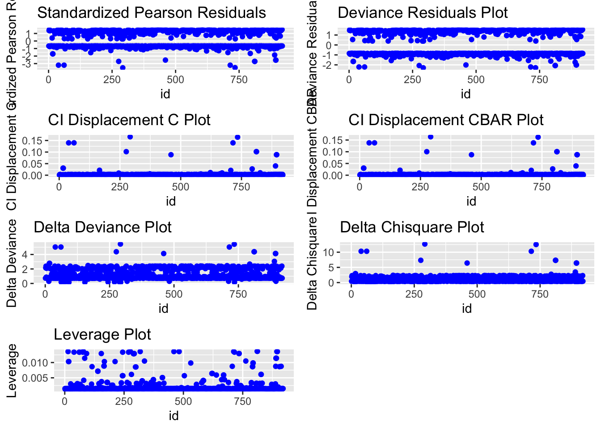
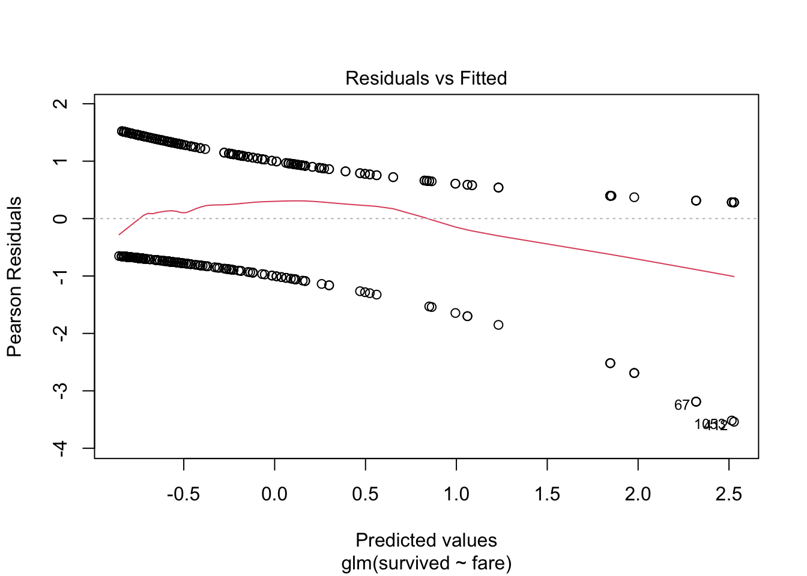
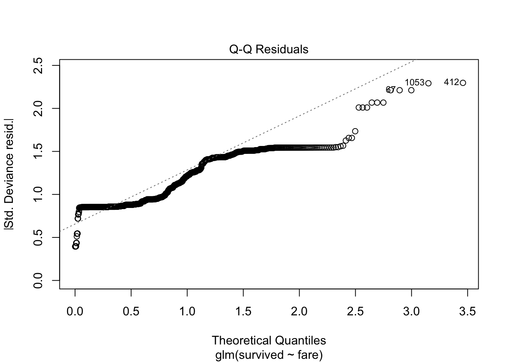
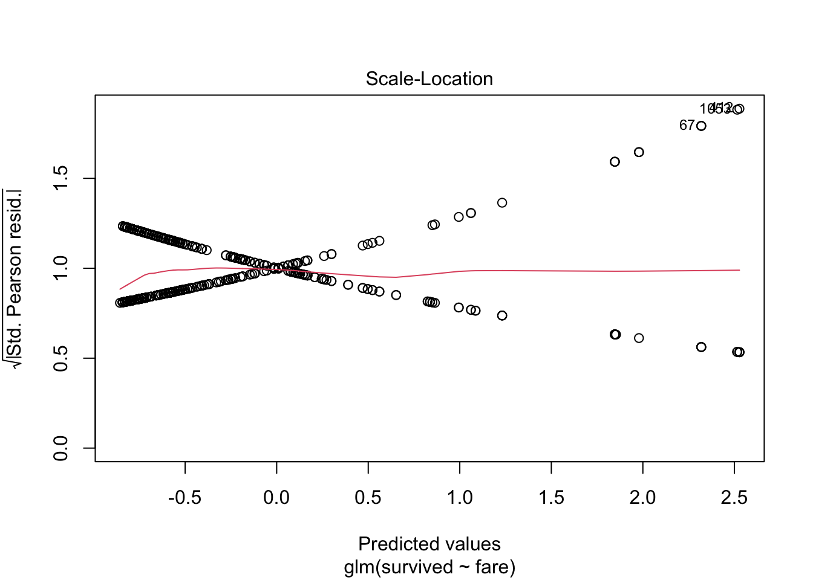
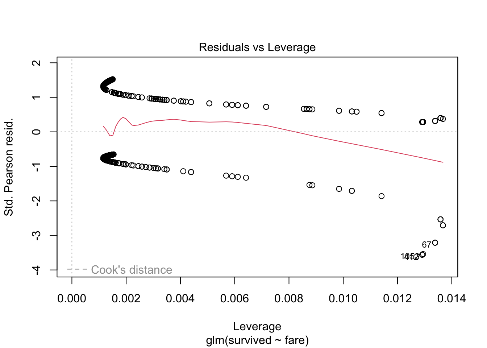
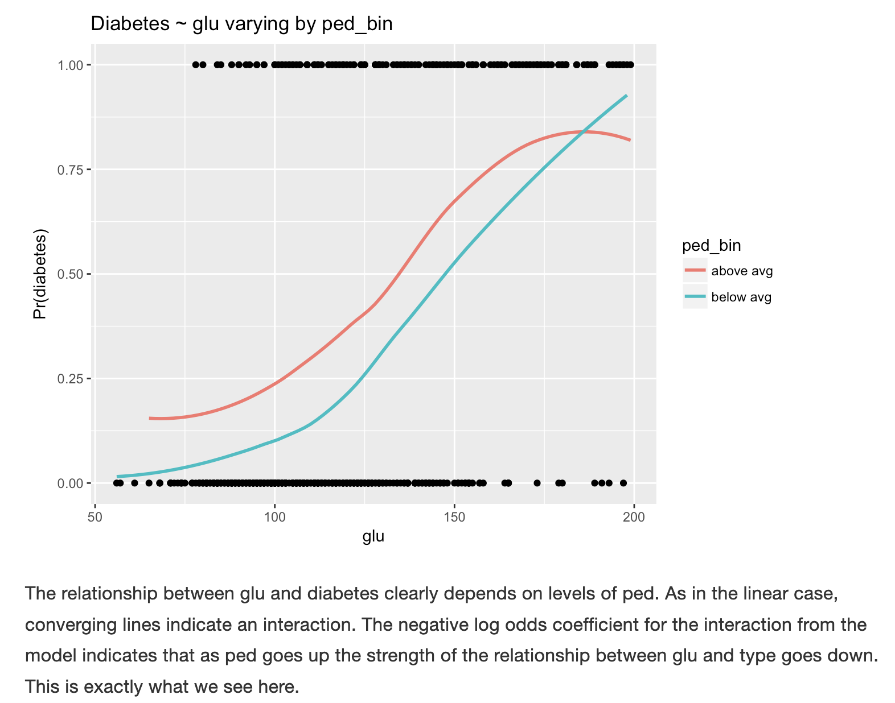

# GLM - Logistic Regression {#S.Tutorial_GLM}

Logistic regression is a method used when we're dealing with categorical dependent variables. It's particularly useful for predicting the probability of an event occurring, fitting data to a logistic curve. While simple linear regression predicts continuous outcomes, logistic regression focuses on probabilities between 0 and 1, making it perfect for scenarios like yes/no or true/false.

Logistic regression is a Generalized Linear Model (GLM), which expands Simple Linear Regression to handle non-normally distributed response variables. GLMs accommodate various response distributions, like binomial (for logistic regression), Poisson, or gamma distributions, making them adaptable to different data types. Within the GLM framework, logistic regression models the relationship between categorical outcomes and predictors by connecting the linear combination of predictors to the log odds of the outcome.

## Great R Tutorial

<https://bookdown.org/jefftemplewebb/IS-6489/logistic-regression.html>

## Setting up the data/example

### Setting up categorical columns

For example, using the titanic dataset from the DALEX package, lets imagine I want to assess whether richer/poorer people were more likely to die on the ship Titanic:

-   [**Dataset**]{.underline}: The titanic data is a complete list of passengers and crew members on the RMS Titanic. It includes a variable indicating whether a person did survive the sinking of the RMS Titanic on April 15, 1912.
-   **Object of analysis**: ADULT PASSENGERS person on the ship titanic - I need to filter the data to achieve this and remove staff and children.
-   **Response variable:** Survival (Yes/No)
    -   To make sure that R understands that this is categorical data (rather than say names/random text), we use the `as.factor()` command to force R to see if as binary data.
-   **Predictor:** The fare paid to board the titanic.

#### Data summary


``` r
data("titanic", package = "DALEX")
ship_survival <- titanic
   
# I'm going to force the response to be a factor
ship_survival$survived <- as.factor(titanic$survived)

skim(ship_survival)
```


Table: (\#tab:unnamed-chunk-1)Data summary

|                         |              |
|:------------------------|:-------------|
|Name                     |ship_survival |
|Number of rows           |2207          |
|Number of columns        |9             |
|_______________________  |              |
|Column type frequency:   |              |
|factor                   |5             |
|numeric                  |4             |
|________________________ |              |
|Group variables          |None          |


**Variable type: factor**

|skim_variable | n_missing| complete_rate|ordered | n_unique|top_counts                              |
|:-------------|---------:|-------------:|:-------|--------:|:---------------------------------------|
|gender        |         0|          1.00|FALSE   |        2|mal: 1718, fem: 489                     |
|class         |         0|          1.00|FALSE   |        7|3rd: 709, vic: 431, 1st: 324, eng: 324  |
|embarked      |         0|          1.00|FALSE   |        4|Sou: 1616, Che: 271, Bel: 197, Que: 123 |
|country       |        81|          0.96|FALSE   |       48|Eng: 1125, Uni: 264, Ire: 137, Swe: 105 |
|survived      |         0|          1.00|FALSE   |        2|no: 1496, yes: 711                      |


**Variable type: numeric**

|skim_variable | n_missing| complete_rate|  mean|    sd|   p0| p25|   p50|   p75|   p100|hist  |
|:-------------|---------:|-------------:|-----:|-----:|----:|---:|-----:|-----:|------:|:-----|
|age           |         2|          1.00| 30.44| 12.16| 0.17|  22| 29.00| 38.00|  74.00|▁▇▆▂▁ |
|fare          |        26|          0.99| 19.77| 43.40| 0.00|   0|  7.15| 20.11| 512.06|▇▁▁▁▁ |
|sibsp         |        10|          1.00|  0.30|  0.84| 0.00|   0|  0.00|  0.00|   8.00|▇▁▁▁▁ |
|parch         |        10|          1.00|  0.23|  0.69| 0.00|   0|  0.00|  0.00|   9.00|▇▁▁▁▁ |

### Filtering data & exploratory plots

I am first going to remove any children from the dataset and any staff (AKA fare = 0), along with the four millionaires that I feel are special cases (e.g. they paid over three times the amount everyone else did)


``` r
ship_survival <- ship_survival[which(ship_survival$fare > 0),]
ship_survival <- ship_survival[which(ship_survival$age > 21),]
ship_survival <- ship_survival[which(ship_survival$fare < 300),]
```

If we only have one predictor, we can use plots like this to get a sense of the impact on our binary response. I included "jittered" data AKA the points are scattered around a little to make them visible. This code comes from the ggplot2 package, so remember to put that in your library code chunk.


``` r
library(ggplot2)

ggplot(ship_survival, aes(x = survived, y = fare)) + 
  geom_boxplot(outlier.shape = NA) +
  geom_jitter(size=.7,alpha=.5,color="blue") +
  coord_flip()
```



Or similarly (but flipped). This code comes from the **ggstatsplot** library/package, so remember to load that first.


``` r
library(ggstatsplot)
ggbetweenstats(ship_survival,y=fare,x=survived,results.subtitle=FALSE)
```



### Fiting a logistic model

Fitting a model is easy - as it's very similar to simple linear models:

-   Instead of `lm` (linear model), we need the `glm` command
-   We also need an extra part to tell R which type of linear model we want. In our case (for binary data), we need `family=binomial(link='logit')`


``` r
model.logistic <- glm(survived ~ fare, data=ship_survival, 
                      family=binomial(link='logit'))
```

<br><br>

### Model summary

**THE OLSRR PACKAGE WILL NO LONGER WORK (it's only set up for lm).** So we are back to the standard summary command.


``` r
summary(model.logistic)
```

```
## 
## Call:
## glm(formula = survived ~ fare, family = binomial(link = "logit"), 
##     data = ship_survival)
## 
## Coefficients:
##             Estimate Std. Error z value Pr(>|z|)    
## (Intercept) -0.92126    0.09134 -10.086  < 2e-16 ***
## fare         0.01311    0.00185   7.087 1.37e-12 ***
## ---
## Signif. codes:  0 '***' 0.001 '**' 0.01 '*' 0.05 '.' 0.1 ' ' 1
## 
## (Dispersion parameter for binomial family taken to be 1)
## 
##     Null deviance: 1225.2  on 919  degrees of freedom
## Residual deviance: 1157.4  on 918  degrees of freedom
## AIC: 1161.4
## 
## Number of Fisher Scoring iterations: 4
```

-   In the output above, the top part is the call, this is R reminding us what the model we ran and the options we selected.

-   The next part of the output shows the coefficients, their standard errors, the z-statistic (sometimes called a Wald z-statistic), and the associated p-values.

-   Below the table of coefficients are fit indices, including the null and deviance residuals and the AIC. Later we show an example of how you can use these values to help assess model fit.

The coefficients themselves are expressed in terms of LOG-ODDS (because this was the transformation we applied).


``` r
# coefficient in terms of Log-odds
cbind(Coefficient_logodds = coef(model.logistic), confint(model.logistic))
```

```
##             Coefficient_logodds        2.5 %     97.5 %
## (Intercept)         -0.92125477 -1.102666988 -0.7443837
## fare                 0.01311288  0.009642147  0.0169076
```

You can also use the exponential command to interpret the output as ODDS-RATIOS, or as the percentage change in odds. We can combine this with confidence intervals and our coefficients using this code.


``` r
# coefficient in terms of odds. Note the exp e.g. we are applying an exponential
exp( cbind(Coefficient_Odds = coef(model.logistic), confint(model.logistic)))
```

```
##             Coefficient_Odds     2.5 %   97.5 %
## (Intercept)        0.3980193 0.3319845 0.475027
## fare               1.0131992 1.0096888 1.017051
```

#### Interpretation in terms of log odds.

To interpret, for every one pound increase in fare, the *log odds* of survival are likely to **increase** between 0.0096421 and 0.0169076.

<br>

#### Interpretation in terms of odds:

We take the exponential of the log odds (see code above). In our new unit, the slope coefficient for fare is 1.0131992 in terms of ODDS.

-   This means that for each unit increase in fare, the odds of survival are multiplied by approximately 1.0131992.

In other words, for every one-year increase in fare, the odds of survival increase by a factor of approximately 1.0131992.

<br>

#### Interpretation in terms of percentage change:

To express the coefficient in terms of percentage change, we subtract 1 from the coefficient in odds, multiply by 100, and interpret the result as a percentage change in the odds:

(Odds Ratio−1)×100=( 1.0131992 −1)×100= 1.3199234 %

So, the coefficient for fare represents an increase in the ODDS of survival by approximately 1.32% for each one-pound increase in fare.

To see more examples of this, see here:\
<https://stats.oarc.ucla.edu/other/mult-pkg/faq/general/faq-how-do-i-interpret-odds-ratios-in-logistic-regression/>

### Predicting new values and visualising results

For prediction, we can do exactly the same as with the lm case e.g. use predict and fitted.


``` r
ship_survival <- ship_survival[is.na(ship_survival$fare)==FALSE,]

ship_survival$modelled_probability <- fitted(model.logistic,
                                             newdata=ship_survival$fare)
```

and this code might help you visualise results (you need to run the prediction bit first.)


``` r
ship_survival$type_num <- ifelse(ship_survival$survived == "yes", 1, 0)

ggplot(ship_survival, aes(fare,type_num)) +
  geom_point(alpha=0.5,size=0.5) +
  stat_smooth(aes(fare, modelled_probability), se = F,lwd=.5) +
  labs(y = "Probability of survival", 
       title = "Probability of surviving the titanic based on fare paid")
```



You can see that the line isn't straight - there are fare brackets that really impact your survival rate, whereas people who paid fares greater 200 pounds saw the relationship level out (AKA they are already first class).

<br><br>

### Wald test for significance

You interpret the significance of the coefficients the same way as your T-test with lm. So we look at the p value in the coefficients table:


``` r
summary(model.logistic)
```

```
## 
## Call:
## glm(formula = survived ~ fare, family = binomial(link = "logit"), 
##     data = ship_survival)
## 
## Coefficients:
##             Estimate Std. Error z value Pr(>|z|)    
## (Intercept) -0.92126    0.09134 -10.086  < 2e-16 ***
## fare         0.01311    0.00185   7.087 1.37e-12 ***
## ---
## Signif. codes:  0 '***' 0.001 '**' 0.01 '*' 0.05 '.' 0.1 ' ' 1
## 
## (Dispersion parameter for binomial family taken to be 1)
## 
##     Null deviance: 1225.2  on 919  degrees of freedom
## Residual deviance: 1157.4  on 918  degrees of freedom
## AIC: 1161.4
## 
## Number of Fisher Scoring iterations: 4
```

> *From the summary, you can see that if the true population had no link between fare and survival (our H0), then a tiny 1.37x10\^-12 proportion of randomly selected samples would have a slope as steep as our sample. So in this case, I think there is a lot of evidence to suggest that we can reject H0 and suggest that fare paid significantly impacted the survival rate of adult Titanic passengers.*

<br><br>

### Goodness of fit

For this, we can use the from the NEW blorr package (AKA you have to go to the app store and install it, then add library(blorr) to your library code chunk)


``` r
library(blorr)
blr_test_hosmer_lemeshow(model.logistic)
```

```
##            Partition for the Hosmer & Lemeshow Test            
## --------------------------------------------------------------
##                         def = 1                 def = 0        
## Group    Total    Observed    Expected    Observed    Expected 
## --------------------------------------------------------------
##   1       129        32        39.18         97        89.82   
##   2       88         16        26.77         72        61.23   
##   3       62         10        18.97         52        43.03   
##   4       90         25        28.03         65        61.97   
##   5       91         25        29.28         66        61.72   
##   6       93         41        31.60         52        61.40   
##   7       91         37        32.73         54        58.27   
##   8       97         41        38.29         56        58.71   
##   9       87         61        42.30         26        44.70   
##  10       92         65        65.86         27        26.14   
## --------------------------------------------------------------
## 
##      Goodness of Fit Test      
## ------------------------------
## Chi-Square    DF    Pr > ChiSq 
## ------------------------------
##  37.1859      8       0.0000   
## ------------------------------
```

<br><br>

### Assessing model residuals

A binned residual plot, available in the arm package, is a good way to see the residuals - to use you will need to install/load the arm package From the documentation:

> *"In logistic regression, as with linear regression, the residuals can be defined as observed minus expected values. The data are discrete and so are the residuals. As a result, plots of raw residuals from logistic regression are generally not useful. The binned residuals plot instead, after dividing the data into categories (bins) based on their fitted values, the average residual versus the average fitted value for each bin."*


``` r
library(arm)

binnedplot(fitted(model.logistic), 
           residuals(model.logistic, type = "response"), 
           nclass = NULL, 
           xlab = "Expected Values", 
           ylab = "Average residual", 
           main = "Binned residual plot", 
           cex.pts = 0.8, 
           col.pts = 1, 
           col.int = "gray")
```



#### Alternative plots

We can also use plots from the blorr package. These are harder to interpret and go a little beyond this course. I suggest this link for the code <https://cran.r-project.org/web/packages/blorr/vignettes/introduction.html> and for the interpretation: <https://bookdown.org/jefftemplewebb/IS-6489/logistic-regression.html>


``` r
library(blorr)

blr_plot_diag_influence(model.logistic)
```



or simply


``` r
plot(model.logistic)
```



<br><br>

### Interactions with other predictors

You can also use this plot to look at interactions and confounding variables with other predictors.Here's a classic example on diabetes to give you a better sense of the plot, as discussed in <https://bookdown.org/jefftemplewebb/IS-6489/logistic-regression.html#assessing-logistic-model-performance>

{width="80%"}
