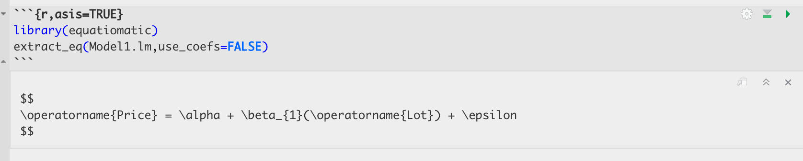
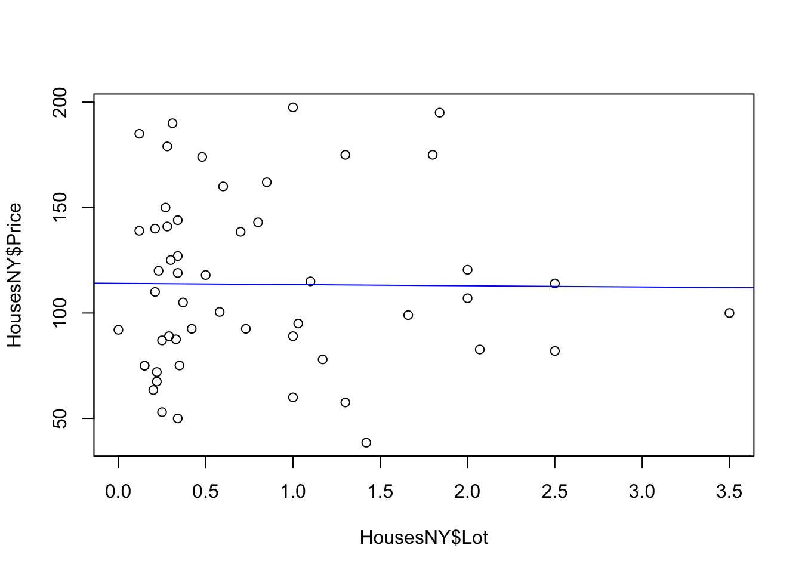
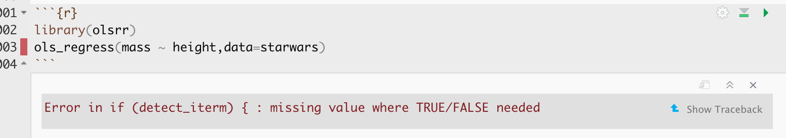

# Regression {#T8_regression}

Now we will fit our first regression model.

## "Standard" regression output {#T8_lmbasics}

The command to do this is `lm()` e.g. linear model.


``` r
output <- lm(y_column ~ x_column,data=tablename)
output
```

NOTE, THE WEIRD \~ SYMBOL. This means "depends on"/"is modelled by" and it's how we tell R what the response variable is. E.g. in y=mx+c, y depends on x, or y is modelled/predicted by x.

For example for the NYHouses dataset, if I wanted to create a model of the Price and Lot columns to see if Lot size could predict house sales price, then I would type.


``` r
# response = Price, predictor = Lot size
Model1.lm <- lm(Price ~ Lot,data=HousesNY)
Model1.lm
```

```
## 
## Call:
## lm(formula = Price ~ Lot, data = HousesNY)
## 
## Coefficients:
## (Intercept)          Lot  
##    114.0911      -0.5749
```

So we are saying here that the equation is

Expected_Average_Price = -0.5749\*Lot_Size + 114.0911

E.g. the average expected price house with no Lot/Garden is 114.09


### Printing out the equation

You can also directly get the code for the model equation by the equatiomatic package


``` r
# YOU MIGHT NEED TO INSTALL THIS PACKAGE (SEE THE TUTORIAL)
library(equatiomatic)
extract_eq(Model1.lm,use_coefs=FALSE)
```

To make it print out directly, put "asis=TRUE" as a code chunk option e.g. this code

<div class="figure">

<p class="caption">(\#fig:eqn)See the asis in the top, this prints the output directly when you knit</p>
</div>

Turns into this:


``` r
library(equatiomatic)
extract_eq(Model1.lm,use_coefs=FALSE)
```

$$
\operatorname{Price} = \alpha + \beta_{1}(\operatorname{Lot}) + \epsilon
$$

You can also look at the summary by looking at the summary command:


``` r
summary(Model1.lm)
```

```
## 
## Call:
## lm(formula = Price ~ Lot, data = HousesNY)
## 
## Residuals:
##     Min      1Q  Median      3Q     Max 
## -74.775 -30.201  -5.941  27.070  83.984 
## 
## Coefficients:
##             Estimate Std. Error t value Pr(>|t|)    
## (Intercept) 114.0911     8.3639  13.641   <2e-16 ***
## Lot          -0.5749     7.6113  -0.076     0.94    
## ---
## Signif. codes:  0 '***' 0.001 '**' 0.01 '*' 0.05 '.' 0.1 ' ' 1
## 
## Residual standard error: 41.83 on 51 degrees of freedom
## Multiple R-squared:  0.0001119,	Adjusted R-squared:  -0.01949 
## F-statistic: 0.005705 on 1 and 51 DF,  p-value: 0.9401
```

In both cases, we have an estimate of the intercept (0.6386) and of the gradient (-13.8103). We will discuss the other values in later labs/lectures.

Now let's see how to add the regression line to our scatterplot. We can do this using `abline(REGRESSION_VARIABLE)`, where regression_variable is the name of the variable you saved the output of lm to. For example.


``` r
plot(HousesNY$Price ~ HousesNY$Lot)
abline(lm(Price ~ Lot,data=HousesNY),col="blue",lwd=1) 
```



For more professional plots, see the scatterplots tutorial

<br>

## "Better" OLSRR regression output

If you want a different way of seeing the same output, you can use the `ols_regress()` command inside the `olsrr` package.


``` r
library(olsrr)
Model1.lm.ols <- ols_regress(Model1.lm)
Model1.lm.ols
```

```
##                           Model Summary                           
## -----------------------------------------------------------------
## R                        0.011       RMSE                 41.035 
## R-Squared                0.000       MSE                1683.876 
## Adj. R-Squared          -0.019       Coef. Var            36.813 
## Pred R-Squared          -0.068       AIC                 550.137 
## MAE                     34.152       SBC                 556.048 
## -----------------------------------------------------------------
##  RMSE: Root Mean Square Error 
##  MSE: Mean Square Error 
##  MAE: Mean Absolute Error 
##  AIC: Akaike Information Criteria 
##  SBC: Schwarz Bayesian Criteria 
## 
##                                ANOVA                                 
## --------------------------------------------------------------------
##                  Sum of                                             
##                 Squares        DF    Mean Square      F        Sig. 
## --------------------------------------------------------------------
## Regression        9.983         1          9.983    0.006    0.9401 
## Residual      89245.412        51       1749.910                    
## Total         89255.395        52                                   
## --------------------------------------------------------------------
## 
##                                     Parameter Estimates                                     
## -------------------------------------------------------------------------------------------
##       model       Beta    Std. Error    Std. Beta      t        Sig       lower      upper 
## -------------------------------------------------------------------------------------------
## (Intercept)    114.091         8.364                 13.641    0.000     97.300    130.882 
##         Lot     -0.575         7.611       -0.011    -0.076    0.940    -15.855     14.705 
## -------------------------------------------------------------------------------------------
```

The ols_regress command produces beautiful output, but sometimes it doesn't work well with other commands. So I tend to run a lm command at the same time to have both available.

<br>

### Errors

Sometimes, this command can produce a weird error:

<div class="figure">

<p class="caption">(\#fig:olsrr.error)This is probably because you loaded the moderndive package</p>
</div>

This is probably because you loaded the moderndive package. They do not play nicely together. Save your work, restart R and **do not run any line that says library(moderndive)!**.
