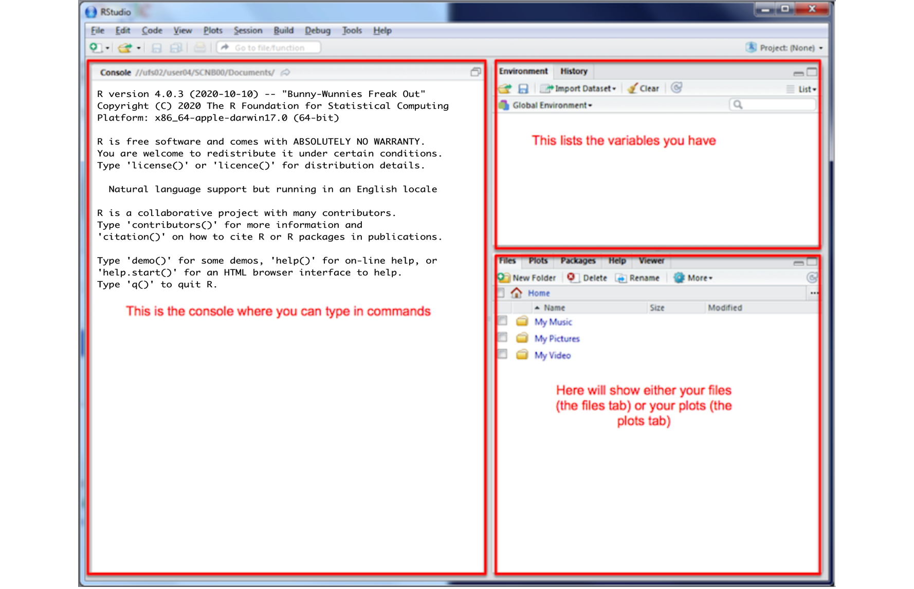

```{r setup, include=FALSE}
knitr::opts_chunk$set(echo = TRUE)
```

# What versions should I be using?
   
What version of R and R studio should you be using?

 - R:  R version 4.5.1 (2025-06-13) -- "Great Square Root"
 - R-Studio:  "Mariposa Orchid"

To update R and R studio, it's easiest to just reinstall.  You will not lose your work!  It just updates the underlying software

------------------------------------------------------------------------------------------------------------------------

# How to Install R

[**STEP 1**]{.underline} <br> Go to <https://posit.co/download/rstudio-desktop/#download>. <br>Scroll down and you
should see something like this.<br>

[{fig-alt="Installing R and R-Studio" fig-align="right"
width="95%"}](https://posit.co/download/rstudio-desktop/#download)

[**STEP 2**]{.underline}<br>Now click on DOWNLOAD AND INSTALL R. It will take you to a scary looking website called Cran
R. <br>Click the "INSTALL R" for your computer type. <br>

[{fig-align="right" width="95%"}](https://cran.rstudio.com/)

[**STEP 3**]{.underline} <br>The setup looks a little different depending on whether you are on a Windows Machine or a
Mac:


### WINDOWS people 

{fig-align="right" width="95%"}

-   Click "Installing R for the first time", EVEN IF YOU ARE UPDATING R-STUDIO

-   This will download a file. Double click to install. You do not need a shortcut on your desktop (because we will use R studio to access it)


### MAC people 

{fig-align="right" width="95%"}

-   There are two potential options for you to download - only one will work, so it's easy to try both if you're not
    sure.

    -   If your Mac is pretty new, try the top option.

    -   If your Mac is more than a few years old, try the second option.

-   This will download a file. Double click to install. If it doesn't work, try downloading the other one.

-   It might say that you cannot open the file because of safety concerns. If that's the case, click the
    magnifying-glass on the top right of your screen, search for settings, click on the security tab and click that it's
    OK to open it. Then try again.


------------------------------------------------------------------------------------------------------------------------

<br>

# How to install R-Studio

[**STEP 4**]{.underline} <br> Go back to <https://posit.co/download/rstudio-desktop/#download>. <br>Now click the other
button. It should automatically download a file onto your computer<br>

{fig-align="right" width="95%"}

-   IF YOU ARE USING WINDOWS: Double click and install as normal.

-   IF YOU ARE USING A MAC, double click, then [**drag the icon into applications.**]{.underline}\
    Nothing should happen!

    -   If you already have R-studio, *replace* the current one.

    -   *(If you have an old mac this might be where it breaks, let Dr G know)*

{fig-align="right" width="90%"}

------------------------------------------------------------------------------------------------------------------------

<br>

# Welcome to R

Now everything is installed, open R-studio (NOT R!). Or open a new workspace in Posit-Cloud


You will be greeted by three panels:

-   The interactive R console (entire left)
-   Environment/History (tabbed in upper right)
-   Files/Plots/Packages/Help/Viewer (tabbed in lower right)



If you wish to learn more about what these windows do, have a look at this resource, from the Pirates Guide to R:
<https://bookdown.org/ndphillips/YaRrr/the-four-rstudio-windows.html>.\

<p class="comment">If you have used R before, you might see that there are variables and plots etc already loaded\*\*. It is always good to
clear these before you start a new analysis. To do this, click the little broom symbol in your environment tab</p>


